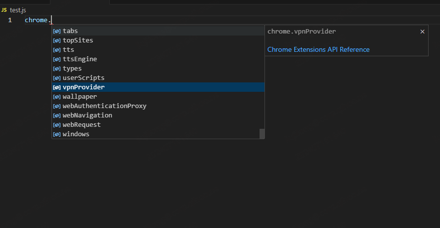
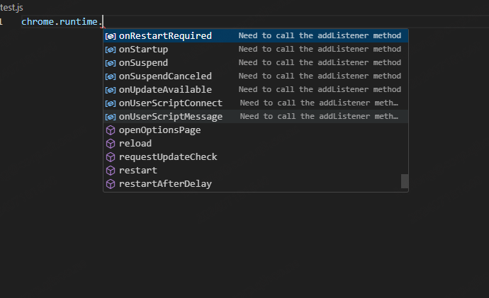
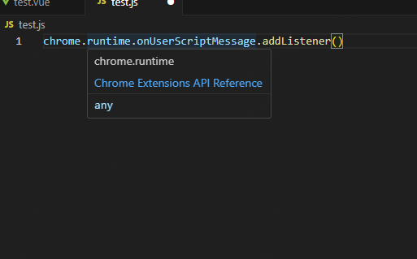
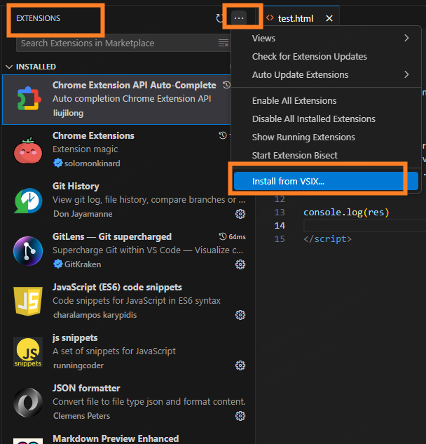

# Features

## Supports all Chrome Extension API prompts for v3 version

### Supports API Auto completion





### Supports hover to display API documentation



## The list of supported languages includes
- javascript
- typescript
- html
- vue

# Usage

## build

```npm
npm run build
```

> Output chrome-extension-api-xxx.vsix in the current directory

## install

> Open your VSCode and select the extension menu


