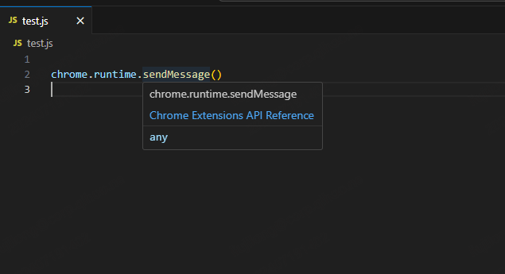

# Features

## Supports all Chrome Extension API prompts for v3 version

> [Chrome Extension API](https://developer.chrome.com/docs/extensions/reference/api)

### Supports API Auto completion


### Supports hover to display API documentation link




## The list of supported languages
- javascript
- typescript
- html
- vue

# Environment

- vscode >= 1.90.0


# Usage


## install

### download

Download the assets in [releases](https://github.com/liujilongObject/vsc-extension-chrome-extension-api/releases)


### editor
> Open your VSCode and select the extension menu, Select the vsix file


### done


# build

### You can clone the code and build it locally

```npm
npm ci && npm run build
```

> Output chrome-extension-api-xxx.vsix in the current directory
